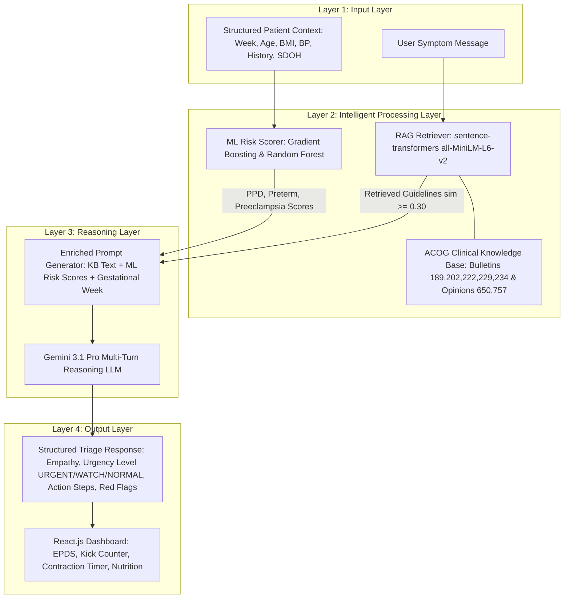

# 🤰 MaternaAI: A Multimodal AI Agent for Pregnancy Symptom Guidance

[](LICENSE)
[](https://www.python.org/downloads/)
[](#-paper--authors--acceptance)
[](https://react.dev/)
[](https://fastapi.tiangolo.com/)

---

## 📜 Paper / Authors / Acceptance

- **Title:** MaternaAI: A Multimodal AI Agent for Pregnancy Symptom Guidance
- **Venue:** Accepted for Publication
- **Status:** Accepted for Publication

### Authors:
- **[Kundan Sagar Bedmutha](https://github.com/kundanbedmutha)** ([ORCID: 0009-0000-4391-3107](https://orcid.org/0009-0000-4391-3107)) — *Lead Researcher*, Dept. of Artificial Intelligence, Vishwakarma University, Pune, India
- **Riddhi Kothari** ([ORCID: 0009-0001-0735-6654](https://orcid.org/0009-0001-0735-6654)) — *Co-Author*, Dept. of Artificial Intelligence, Vishwakarma University, Pune, India
- **Bhoomi Budhani** ([ORCID: 0009-0008-9983-7332](https://orcid.org/0009-0008-9983-7332)) — *Co-Author*, Dept. of Artificial Intelligence, Vishwakarma University, Pune, India
- **Aaditya Dhanwate** ([ORCID: 0009-0001-0898-8960](https://orcid.org/0009-0001-0898-8960)) — *Co-Author*, Dept. of Artificial Intelligence, Vishwakarma University, Pune, India
- **Madhvi Saxena** ([ORCID: 0000-0001-9718-5766](https://orcid.org/0000-0001-9718-5766)) — *Co-Author*, Dept. of AI & ML, Symbiosis Institute of Technology (SIT), Pune, India
- **Prashant Saxena** ([ORCID: 0000-0002-7435-2936](https://orcid.org/0000-0002-7435-2936)) — *Co-Author / Advisor*, Dept. of Bioinformatics, Chandigarh University, Chandigarh, India

---

## 📖 Abstract

Pregnancy-related complications are one of the top causes of morbidity for both mother and child worldwide. In low- and middle-income countries (LMICs), where access to antenatal care is limited, timely and accessible symptom triage is especially important. This paper presents **MaternaAI**, a multimodal intelligent pregnancy companion using a combination of three artificial intelligence technologies:
1. **Retrieval-Augmented Generation (RAG)** over an ACOG clinical knowledge base for well-informed symptom triage;
2. **Ensemble Machine Learning-based scoring models** using Gradient Boosting for Postpartum Depression (PPD), Random Forest for Preterm Birth and Preeclampsia on a CDC PRAMS dataset of $5,000$ records; and
3. **Gemini 3.1 Pro**, a multi-turn reasoning LLM.

When evaluated using a held-out set of $1,000$ records for each model, MaternaAI achieves an **ROC-AUC of 0.662** for PPD risk, **0.577** for preterm birth, and **0.615** for preeclampsia. The system also includes a Cardiff-method-based kick counter, Edinburgh Postnatal Depression Scale (EPDS)-based screening, contraction timer, due date calculator, and trimester-based nutrition guide, delivered as a React.js frontend with a FastAPI backend. To the best of our knowledge, MaternaAI is the first system to integrate RAG, multi-model ML risk scoring, and a large language model into a single perinatal health agent.

---

## 🌟 Key Contributions

1. **ACOG-Grounded RAG Pipeline**: Developed a clinical retrieval-augmented generation engine utilizing `sentence-transformers` (`all-MiniLM-L6-v2`) over ACOG Practice Bulletins and Committee Opinions with a relevance threshold $\tau = 0.30$ and top-$K = 2$ retrieval to eliminate LLM hallucinations.
2. **Multi-Outcome Ensemble ML Risk Stratification**: Trained 3 ensemble models on $5,000$ CDC PRAMS-structured records across 23 clinical and SDOH variables, achieving held-out ROC-AUCs of **0.662** (PPD - Gradient Boosting), **0.577** (Preterm Birth - Random Forest), and **0.615** (Preeclampsia - Random Forest).
3. **Trimester-Aware Empathetic Reasoning**: Integrated Gemini 3.1 Pro via a structured 6-stage prompt generator (Empathy $\rightarrow$ Urgency Triage $\rightarrow$ Clinical Explanation $\rightarrow$ Actionable Steps $\rightarrow$ Red Flags $\rightarrow$ Gestational Week Context).
4. **Comprehensive Perinatal Web Companion**: Created a full-stack production application featuring validated EPDS depression screening, Cardiff kick counter, contraction timer, Naegele's due date calculator, and trimester-aware nutrition guidelines.
5. **LMIC-Deployable & Non-Invasive Design**: Prioritized low-resource feasibility by utilizing routine antenatal clinical and social determinants of health (SDOH) variables without requiring invasive lab tests or microbiome sequencing.

---

## 🏗️ System Architecture

MaternaAI follows a four-layer architecture separating data ingestion, intelligent processing, reasoning, and user delivery:



### ASCII Pipeline Overview
```
+-------------------------------------------------------------------------------+
|                             LAYER 1: INPUT LAYER                              |
|   Free-text Symptom Message   +   Structured Profile (Week, BMI, BP, SDOH)   |
+---------------------------------------+---------------------------------------+
                                        |
                                        v
+---------------------------------------+---------------------------------------+
|                    LAYER 2: INTELLIGENT PROCESSING                            |
|  [RAG Branch]                                     [ML Risk Scorer Branch]     |
|  all-MiniLM-L6-v2 (384-d)                         PPD: Gradient Boosting      |
|  ACOG KB (sim >= 0.30, K=2)                       Preterm/PE: Random Forest   |
+---------------------------------------+---------------------------------------+
                                        |
                                        v
+---------------------------------------+---------------------------------------+
|                         LAYER 3: REASONING LAYER                              |
|   Gemini 3.1 Pro (6-Stage Trimester-Aware Prompt: Empathy -> Urgency -> Steps)|
+---------------------------------------+---------------------------------------+
                                        |
                                        v
+---------------------------------------+---------------------------------------+
|                          LAYER 4: OUTPUT LAYER                                |
|   Urgency Triage (URGENT / WATCH / NORMAL) + Actionable Guidance + Red Flags  |
+-------------------------------------------------------------------------------+
```

---

## 🔬 Methodology

### 1. Data Collection & Integration
We generated a structured synthetic dataset ($N = 5,000$ records) following the distribution statistics published by the CDC Pregnancy Risk Assessment Monitoring System (PRAMS). The dataset contains 23 features spanning clinical variables (gestational diabetes, hypertension, depression history, smoking) and Social Determinants of Health (SDOH: income, marital status, education level).

Target variable prevalences:
$$\text{Prevalence } P(y=1) = \frac{N_{\text{positive}}}{N_{\text{total}}}$$

$$\text{Prevalences: } \text{PPD} = 19.2\% \quad (N=960), \quad \text{Preterm Birth} = 14.7\% \quad (N=735), \quad \text{Preeclampsia} = 8.4\% \quad (N=420)$$

### 2. Feature Engineering & Preprocessing
Data split: **80/20 stratified split** ($N_{\text{train}} = 4,000$, $N_{\text{test}} = 1,000$). Missing values imputated via median. Continuous features include pre-pregnancy BMI, gestational week, age, systolic/diastolic BP, and weight gain.

### 3. Model Architecture & Training
* **Postpartum Depression (PPD)**: Gradient Boosting Classifier
  $$\hat{y} = \sum_{m=1}^{M} \eta \cdot h_m(x)$$
  Hyperparameters: $M = 200$ estimators, learning rate $\eta = 0.05$, max depth $= 4$.

* **Preterm Birth & Preeclampsia**: Random Forest Classifier
  $$\hat{P}(y=1 \mid x) = \frac{1}{T} \sum_{t=1}^{T} h_t(x)$$
  Hyperparameters: $T = 300$ trees, `class_weight='balanced'` to handle class imbalance.

### 4. RAG Retrieval Formulation
* **Encoding**:
  $$e_i = f_\theta(d_i) \in \mathbb{R}^{384}, \quad q = f_\theta(q) \in \mathbb{R}^{384}$$
* **Cosine Similarity**:
  $$\text{sim}(q, d_i) = \frac{q \cdot e_i}{\|q\| \|e_i\|}$$
* **Retrieval Protocol**:
  $$\text{Retrieve } d_i \quad \text{if } \text{sim}(q, d_i) \ge \tau \quad (\tau = 0.30, \, K = 2)$$

### 5. Evaluation Metrics
$$\text{ROC-AUC} = \int_{0}^{1} \text{TPR}(t) \, d\text{FPR}(t)$$

$$\text{Sensitivity} = \frac{\text{TP}}{\text{TP} + \text{FN}}, \quad \text{Specificity} = \frac{\text{TN}}{\text{TN} + \text{FP}}, \quad \text{Accuracy} = \frac{\text{TP} + \text{TN}}{\text{TP} + \text{TN} + \text{FP} + \text{FN}}$$

---

## 📊 Research Results

### Table I: Model Performance Summary (Held-Out Test Set $N=1,000$)

| Model | ROC-AUC | 5-Fold CV AUC $\pm$ SD | Sensitivity | Specificity | Accuracy | Primary Predictor |
| :--- | :---: | :---: | :---: | :---: | :---: | :--- |
| **PPD Risk (Gradient Boosting)** | **0.662** | $0.640 \pm 0.013$ | 9.8% | **97.0%** | 76.6% | Weight Gain ($0.173$) |
| **Preterm Birth (Random Forest)** | **0.577** | $0.577 \pm 0.018$ | 51.0% | **87.3%** | **79.2%** | Gestational Week ($0.155$) |
| **Preeclampsia (Random Forest)** | **0.615** | $0.624 \pm 0.030$ | **52.7%** | 69.1% | 67.6% | Hypertension History ($0.177$) |

*Note: All metrics computed at default decision threshold $0.5$.*

---

### Table II: System & Literature Model Comparison

| System / Study | Outcomes Assessed | Best AUC | RAG Grounded | LLM Triage | Validated EPDS | LMIC Ready | Open Deployable |
| :--- | :--- | :---: | :---: | :---: | :---: | :---: | :---: |
| **MaternaAI (Ours)** | **PPD + Preterm + Preeclampsia** | **0.662** | **✓** | **✓** | **✓** | **✓** | **✓** |
| Zhang et al. [1] (2025) | PPD only | 0.780 | ✗ | ✗ | ✗ | ✗ | ✗ |
| Hurwitz et al. [3] (2024) | PPD only | 0.710 | ✗ | ✗ | ✗ | ✗ | ✗ |
| PIERS-ML [7] (2024) | Preeclampsia | 0.830 | ✗ | ✗ | ✗ | ✓ | ✗ |
| Chakoory et al. [13] (2024) | Preterm birth | 0.850 | ✗ | ✗ | ✗ | ✗ | ✗ |
| Leitner et al. [16] (2025) | Postpartum care | N/A | ✗ | Partial | ✗ | ✗ | ✗ |
| Abbasian et al. [18] (2025) | General health | N/A | ✗ | ✓ | ✗ | ✗ | ✗ |
| Raw GPT-4 / Gemini | General health | N/A | ✗ | ✓ | ✗ | ✗ | ✗ |

---

### Feature Importance & Attribution Summary

| Feature Name | PPD (GBM) Importance | Preterm (RF) Importance | Preeclampsia (RF) Importance |
| :--- | :---: | :---: | :---: |
| **Weight Gain (lbs)** | **0.173** | 0.137 | 0.122 |
| **Depression History** | **0.147** | — | — |
| **Pre-pregnancy BMI** | **0.149** | 0.133 | 0.134 |
| **Systolic / Diastolic BP** | 0.220 (combined) | 0.211 (combined) | **0.218 (combined)** |
| **Hypertension History** | — | — | **0.177** |
| **Previous Preterm Birth** | — | **0.160** | — |
| **Gestational Week** | 0.092 | **0.155** | 0.088 |

---

## 💻 Interactive Application / Dashboard

The repository includes a production-ready web companion built with **React 18** and **FastAPI**:

| Component | Description | Route / Endpoint |
| :--- | :--- | :--- |
| 🩺 **Symptom Triage Chat** | RAG-grounded conversational agent powered by Gemini 3.1 Pro | `POST /chat` |
| 📋 **EPDS Mood Screening** | Validated 10-item Edinburgh Postnatal Depression Scale | `Frontend Component` |
| ⏱️ **Kick Counter & Timer** | Cardiff count-to-10 kick tracker & contraction duration logger | `Frontend Component` |
| 📅 **Due Date Calculator** | Naegele's Rule calculator with milestone bar & star sign | `Frontend Component` |
| 🥗 **Nutrition Guide** | Trimester-aware meal & nutrient recommendation engine | `Frontend Component` |

---

## 📁 Repository Structure

```
materna_ai/
├── agent/
│   ├── materna_agent.py        # Core Gemini + RAG + Risk Scoring pipeline
│   └── prepare_datasets.py     # Dataset generator & vector KB encoder
├── app/
│   ├── api.py                  # FastAPI REST server (/chat, /reset, /health)
│   └── streamlit_app.py        # Streamlit web UI alternative
├── data/
│   └── symptom_knowledge_base.json  # ACOG clinical guideline embeddings
├── datasets/
│   └── cdc_prams_structured.csv     # Synthetic CDC PRAMS dataset (5,000 records)
├── models/
│   ├── train_risk_models.py    # Training script for ML classifiers
│   ├── ppd_model.joblib        # Pre-trained PPD Risk model
│   ├── preeclampsia_model.joblib # Pre-trained Preeclampsia Risk model
│   ├── preterm_model.joblib    # Pre-trained Preterm Birth Risk model
│   ├── *_meta.json             # Model feature definitions & metrics
│   └── training_summary.json   # Full training evaluation report
├── frontend/
│   ├── public/index.html       # Web app HTML shell
│   └── src/                    # React source code & components
├── requirements.txt            # Python dependencies
├── .env.example                # Environment variables template
├── MaternaAI_Presentation.html # Interactive research presentation deck
├── README.md                   # Project documentation
└── run.py                      # FastAPI launcher script
```

---

## ⚙️ Installation

### Prerequisites
- **Python 3.10+**
- **Node.js 18+** & `npm`
- **Gemini API Key** (obtainable from [Google AI Studio](https://aistudio.google.com))

### 1. Clone Repository & Setup Environment
```bash
git clone https://github.com/kundanbedmutha/Materna-AI.git
cd Materna-AI

# Create virtual environment
python -m venv venv

# Activate environment
# On Windows:
venv\Scripts\activate
# On Linux/macOS:
source venv/bin/activate

# Install dependencies
pip install -r requirements.txt
```

### 2. Configure API Keys
```bash
cp .env.example .env
# Edit .env and set your key:
# GEMINI_API_KEY=your_actual_gemini_api_key
```

---

## 🏋️ Training & Running

### Option A: Run the Backend & Frontend (Full Stack)

**Terminal 1 — Backend (FastAPI)**:
```bash
python run.py
# Server starts at http://localhost:8000
```

**Terminal 2 — Frontend (React.js)**:
```bash
cd frontend
npm install
npm start
# Web app opens at http://localhost:3000
```

### Option B: Retrain ML Risk Models
To retrain the PPD, Preterm Birth, and Preeclampsia classifiers:
```bash
python models/train_risk_models.py
```

---

## 🔍 XAI & Analysis

The risk model outputs include feature attribution values computed using Mean Decrease in Impurity (MDI). To inspect feature importances programmatically:

```python
import joblib, json

# Load metadata and model
meta = json.load(open("models/preeclampsia_meta.json"))
model = joblib.load("models/preeclampsia_model.joblib")

# Print top features
for feat, imp in zip(meta["features"], model.feature_importances_):
    print(f"{feat}: {imp:.4f}")
```

---

## 🧪 Verification & Evaluation

Run unit verification on agent components:
```bash
python agent/materna_agent.py
```

Expected output:
```
=== MaternaAI Agent Test ===
[RAG] Loaded 8 knowledge base entries
[RiskScorer] Loaded 3 risk models
[MaternaAgent] Initialized with gemini-3.1-pro-preview

--- AGENT RESPONSE ---
1. EMPATHY: I understand that experiencing swelling in your feet and ankles can be concerning...
2. URGENCY: WATCH - Swelling is common, but requires monitoring for sudden increases...
```

---

## 📊 Dataset & Preprocessing

The dataset `datasets/cdc_prams_structured.csv` was constructed using empirical marginal distributions published in CDC PRAMS surveillance reports. It includes:
* **Demographics**: Age, Pre-pregnancy BMI, Education, Household Income, Marital Status.
* **Medical History**: Previous Preterm Birth, Gestational Diabetes, Chronic/Gestational Hypertension, Depression History.
* **Current Symptoms**: Nausea, Back Pain, Swelling, Headache, Blurry Vision, Reduced Fetal Movement.
* **Vitals**: Systolic & Diastolic Blood Pressure, Weight Gain (lbs).

---

## 🔄 Reproducibility

* **Random Seeds**: Fixed at `random_state=42` across all `train_test_split`, `RandomForestClassifier`, and `GradientBoostingClassifier` instances.
* **Cross-Validation**: 5-Fold Stratified Cross-Validation protocol.
* **Hardware**: Executable on CPU (Intel Core i5/i7 or Apple Silicon) with <4GB RAM.

---

## ⚠️ Limitations

1. **Synthetic Training Data**: The ML models were trained on synthetic data matching CDC PRAMS marginal distributions rather than raw patient Electronic Health Records (EHRs).
2. **Knowledge Base Coverage**: The RAG pipeline currently index 8 core ACOG guidelines, which covers common symptoms but may lack coverage for rare obstetric complications.
3. **API Dependency**: Current LLM reasoning relies on cloud-hosted Gemini API calls, requiring active internet connectivity.

---

## 🔮 Future Work

* **Federated Learning**: Enable privacy-preserving model training across decentralized LMIC hospital networks without aggregating patient data.
* **On-Device LLM Inference**: Quantize open-weight models (e.g., Llama-3-8B / Gemma) for offline mobile execution in remote areas.
* **Wearable Sensor Integration**: Incorporate continuous biomarker streaming (HRV, continuous BP, $\text{SpO}_2$) from consumer wearables.

---

## 📝 Citation

If you find MaternaAI useful in your research or application, please cite our paper:

```bibtex
@inproceedings{bedmutha2026maternaai,
  title={MaternaAI: A Multimodal AI Agent for Pregnancy Symptom Guidance},
  author={Bedmutha, Kundan Sagar and Kothari, Riddhi and Budhani, Bhoomi and Dhanwate, Aaditya and Saxena, Madhvi and Saxena, Prashant},
  booktitle={Accepted for Publication in Research Proceedings},
  year={2026}
}
```

---

## 📜 License

Licensed under the [MIT License](LICENSE).

---

## 👥 Authors & Contributors

* **Kundan Sagar Bedmutha** — [@kundanbedmutha](https://github.com/kundanbedmutha) | [ORCID: 0009-0000-4391-3107](https://orcid.org/0009-0000-4391-3107)
* **Riddhi Kothari** — [ORCID: 0009-0001-0735-6654](https://orcid.org/0009-0001-0735-6654)
* **Bhoomi Budhani** — [ORCID: 0009-0008-9983-7332](https://orcid.org/0009-0008-9983-7332)
* **Aaditya Dhanwate** — [ORCID: 0009-0001-0898-8960](https://orcid.org/0009-0001-0898-8960)
* **Madhvi Saxena** — [ORCID: 0000-0001-9718-5766](https://orcid.org/0000-0001-9718-5766)
* **Prashant Saxena** — [ORCID: 0000-0002-7435-2936](https://orcid.org/0000-0002-7435-2936)